<div align="center">

# 🌐 Evo Builder (EvoBrowser Engine)
### AI-Planned, Real-Time Collaborative Visual Browser Automation

**Describe a goal in plain language, get an editable workflow, run it in a managed cloud browser, watch the AI act live, and get readable results with a replay of every run.**

[](https://nextjs.org/)
[](https://react.dev/)
[](https://stagehand.dev/)
[](https://browserbase.com/)
[](https://trigger.dev/)
[](https://liveblocks.io/)
[](https://clerk.com/)
[](https://neon.tech/)
[](https://orm.drizzle.team/)
[](https://sentry.io/)

<br />

<p align="center">
  <a href="#-project-overview">Overview</a> &nbsp;&bull;&nbsp;
  <a href="#-workflow-lifecycle">Lifecycle</a> &nbsp;&bull;&nbsp;
  <a href="#-key-features">Key Features</a> &nbsp;&bull;&nbsp;
  <a href="#-workflow-node-catalog">Node Catalog</a> &nbsp;&bull;&nbsp;
  <a href="#-system-architecture">Architecture</a> &nbsp;&bull;&nbsp;
  <a href="#-phase-2--the-evo-engine">Phase 2</a> &nbsp;&bull;&nbsp;
  <a href="#-getting-started">Getting Started</a> &nbsp;&bull;&nbsp;
  <a href="#-testing">Testing</a> &nbsp;&bull;&nbsp;
  <a href="#-observability--security">Security</a>
</p>

<br />


<p align="center"><sub>Interactive React Flow canvas synchronized in real-time across users via Liveblocks, executing durable AI browser actions with live step telemetry.</sub></p>

</div>

---

## 📖 Project Overview

**Evo Builder** is a multi-tenant visual browser-automation platform. It combines a natural-language **AI workflow planner** with a **multiplayer visual canvas**, executes workflows as **durable background tasks** in managed cloud browsers, and provides **live viewing and frame-accurate replay** of every run.

The core loop:

1. **Describe** an automation goal in plain language.
2. The **AI planner** converts it into a validated, editable workflow graph — using only the node types the engine actually supports.
3. You **review and edit** the generated workflow on the collaborative canvas.
4. You **explicitly press Run** — nothing executes automatically.
5. The workflow runs as a **durable Trigger.dev task**, driving a real Browserbase cloud browser.
6. You **watch the live browser** beside the canvas — with **on-page highlights showing exactly what the AI is acting on, observing, and extracting** — and browser steps hold until your live view is actually connected.
7. You can **Stop** at any time; the browser session is always cleaned up.
8. When the run finishes you get a **readable results popup** — what was extracted, a **final screenshot** of the page, the final URL, and measured timing — plus a **video replay**.
9. The workflow stays an **ordinary editable graph** — edit it and run it again, with a fresh session each time.

**Evo Builder is built on:**
1. **AI Workflow Planner**: A server-only planner that turns a natural-language goal into a strict, schema-validated workflow plan derived from the live node registry — it can never invent node types the engine doesn't have.
2. **Multiplayer Visual Canvas**: A drag-and-drop graph canvas built on `@xyflow/react` and `@liveblocks/react-flow`, with live cursors, presence, and organization-scoped rooms.
3. **AI-Native Browser Engine (Stagehand V3 + Gemini 2.5 Flash)**: Natural-language `act`, `observe`, `extract`, and autonomous `agent` actions that adapt to DOM changes instead of brittle selectors.
4. **Managed Cloud Browsers (Browserbase)**: Isolated cloud browser sessions with built-in recording, live debug view, and HLS replay.
5. **Dual Execution Engines**: the Phase-1 **Trigger.dev** engine (the default) and the Phase-2 **Evo engine** — a C++20 concurrent DAG scheduler with a Redis Streams + Postgres distributed worker runtime — selectable behind a fail-closed server-side feature flag.
6. **Multi-Tenant SaaS**: Organization isolation via Clerk Auth, Pro-plan gates via Clerk Billing, and serverless Neon Postgres via Drizzle ORM.

> **Scope note:** The **default engine is the Phase-1 Trigger.dev path**: a single sequential durable task that walks the DAG node-by-node and drives **one shared cloud browser session per run**. Phase 2 adds the **Evo engine** beside it (opt-in via `EXECUTION_ENGINE=evo`): a C++20 dependency-aware scheduler, durable run store, and TypeScript worker fleet. Nothing about Phase 2 changes Phase-1 default behavior — the flag is fail-closed, and any value other than `evo` stays on Trigger.dev. See [Phase 2 — the Evo engine](#-phase-2--the-evo-engine) and `docs/phase2/` for the full design, evidence, and limitations.

---

## 🔁 Workflow Lifecycle

The full lifecycle that Phase 1 implements and regression-tests end to end:

```
Prompt
  → AI plan (server-validated, registry-derived)
  → editable workflow preview (on the collaborative canvas)
  → explicit Run (user presses the Run button)
  → live browser (Browserbase live view beside the canvas,
     with on-page highlights of what the AI touches;
     browser steps wait for the live view to connect)
  → Stop (optional; always cleans up the session)
  → results (readable popup: extractions, final screenshot,
     final URL, timing) + HLS video replay
  → edit (the graph stays ordinary and editable)
  → rerun (fresh run identity + fresh browser session)
```

**Guarantees enforced across repeated runs:**

- Each run has an **independent run identity** and its **own Browserbase session**.
- Run #2 never shows Run #1's live view; replays always resolve the **selected historical run's** recording.
- **Stop** cancels only the live run and never touches a completed one.
- Node status paint always reflects the **newest/live run** — no stale "running" state after a run ends.
- The planner never leaves a **stale loading state**, never **duplicates generation**, and nothing **executes automatically**.
- **Automation never races the view**: when a run contains browser steps, the engine holds them until the Live Browser panel reports connected (up to a bounded timeout), so you never miss the action. Runs without browser steps and runs nobody is watching skip the gate.
- The results popup opens **only when a run reaches a terminal state** — never on the Run click itself — and the "AI Workflow Preview" banner clears the moment a run starts.

---

## ✨ Key Features

<table>
  <tr>
    <td width="50%" valign="top">
      <h3>🧠 AI Workflow Planner</h3>
      <ul>
        <li>New workflows open a <strong>"What do you want to automate?"</strong> screen.</li>
        <li>Server-only planner call — the provider key never reaches the client.</li>
        <li>The node catalog is <strong>derived from the live registry</strong>, so the AI can only use real node types.</li>
        <li>Strict runtime schema validation + semantic checks (one Start, unique IDs, no cycles, valid edges).</li>
        <li>If a goal can't be built, it returns <code>canBuild: false</code> with a reason instead of hallucinating nodes.</li>
        <li><strong>Build manually</strong> escape hatch to the normal canvas at any time.</li>
      </ul>
    </td>
    <td width="50%" valign="top">
      <h3>🎨 Visual Workflow Canvas</h3>
      <ul>
        <li>Interactive graph interface powered by <strong>@xyflow/react</strong>.</li>
        <li>Smooth-step connections with smart handle snapping.</li>
        <li>Custom node components with live status borders, spinners, and error states.</li>
        <li>Deterministic layered layout applied to AI-generated graphs.</li>
        <li>Generated graphs become <strong>ordinary editable canvas state</strong> — no separate "AI editor".</li>
      </ul>
    </td>
  </tr>
  <tr>
    <td width="50%" valign="top">
      <h3>👥 Real-Time Collaboration</h3>
      <ul>
        <li>Collaborative editing via <strong>Liveblocks</strong> CRDTs.</li>
        <li>Shared node positions, properties, and edges in real time.</li>
        <li>Live cursors, selection highlights, and avatar presence.</li>
        <li>Organization-scoped room authorization.</li>
      </ul>
    </td>
    <td width="50%" valign="top">
      <h3>🤖 AI Browser Automation (Stagehand V3)</h3>
      <ul>
        <li><strong>Act</strong>: human-like actions from plain-English instructions.</li>
        <li><strong>Extract</strong>: structured data from any page.</li>
        <li><strong>Observe</strong>: discover candidate interactive elements.</li>
        <li><strong>Agent</strong>: autonomous multi-step goals (Pro plan).</li>
      </ul>
    </td>
  </tr>
  <tr>
    <td width="50%" valign="top">
      <h3>🖥️ Live Browser View</h3>
      <ul>
        <li>Watch the real Browserbase session <strong>beside the canvas</strong> while a run is in flight.</li>
        <li>Live session ID is streamed via Trigger.dev realtime metadata the moment the browser opens.</li>
        <li><strong>Fast connect</strong>: 1s polling with a visible "connecting" timer until the stream is live.</li>
        <li><strong>Live-view gate</strong>: browser steps hold until the panel reports connected (bounded timeout), so the run never finishes before you can watch it.</li>
        <li>Debug URL is fetched through a <strong>server-side proxy</strong> that verifies org + run ownership.</li>
        <li>View-only during execution to avoid user/agent input conflicts.</li>
        <li>Clear states: waiting → connecting → live → ended/unavailable.</li>
      </ul>
    </td>
    <td width="50%" valign="top">
      <h3>🎯 Live Action Highlights</h3>
      <ul>
        <li>The engine injects a <strong>real DOM overlay into the driven page</strong>, so highlights appear inside the live video stream itself.</li>
        <li><strong>Act</strong>: a blue box around the element the AI acted on.</li>
        <li><strong>Observe</strong>: amber boxes on every matched candidate.</li>
        <li><strong>Extract</strong>: an "Extracting data… → Extraction complete" status chip.</li>
        <li>Navigation and agent steps show contextual chips ("Navigated to host", "Agent working…").</li>
        <li>Cosmetic-only: highlight failures never break a run.</li>
      </ul>
    </td>
  </tr>
  <tr>
    <td width="50%" valign="top">
      <h3>📊 Run Results Popup & Replay</h3>
      <ul>
        <li>Full-screen, <strong>readable</strong> summary — no raw JSON: extracted items render as headlines with supporting details.</li>
        <li><strong>Final screenshot</strong> of the page the run ended on, captured before the session closes and served from the database.</li>
        <li>Measured run duration, completed/failed node counts, final URL, and per-step outputs.</li>
        <li>Auto-opens <strong>only when the run reaches a terminal state</strong> (completed / failed / canceled) — never mid-run.</li>
        <li><strong>Run Again</strong> re-runs the graph as it exists on the canvas now; <strong>Watch Replay</strong> jumps to the HLS recording.</li>
        <li>Server-proxied HLS video replay, gated to the Pro plan.</li>
      </ul>
    </td>
    <td width="50%" valign="top">
      <h3>⚡ Durable Execution (Trigger.dev)</h3>
      <ul>
        <li>Topological ordering of the graph for deterministic dependency order.</li>
        <li>Long-running background tasks (up to 3600s) with automatic retries.</li>
        <li>Real-time step metadata streaming to the canvas and console.</li>
        <li>One-click <strong>Stop</strong> with guaranteed browser-session cleanup.</li>
      </ul>
    </td>
  </tr>
  <tr>
    <td width="50%" valign="top">
      <h3>🛡️ Resilience & Reliability</h3>
      <ul>
        <li><strong>Auth hardening</strong>: server auth reads retry once on transient session misses (short-lived dev tokens, slow compiles) instead of failing the request.</li>
        <li><strong>AI gateway retries</strong>: planner provider calls retry up to 5× with capped exponential backoff on 408/429/5xx gateway errors; 401s fail fast.</li>
        <li><strong>Liveblocks storage gating</strong>: generated graphs are applied only after room storage has loaded — no "mutation before storage loaded" errors.</li>
        <li>Live-view connection state and run screenshot artifacts are persisted in Postgres, surviving page reloads.</li>
      </ul>
    </td>
    <td width="50%" valign="top">
      <h3>🔗 Dynamic Interpolation</h3>
      <ul>
        <li>Pass outputs between nodes with <code>{{ nodeId.path }}</code>.</li>
        <li>Deep dot-notation and array indexing (e.g. <code>{{ observe_1.matches[0].selector }}</code>).</li>
        <li>Clickable connection chips in the node inspector.</li>
        <li>Safe null-coalescing and JSON stringification.</li>
      </ul>
    </td>
  </tr>
  <tr>
    <td width="50%" valign="top">
      <h3>🏢 Multi-Tenant SaaS</h3>
      <ul>
        <li><strong>Clerk Auth & Organizations</strong>: tenant separation and org switching.</li>
        <li><strong>Clerk Billing</strong>: Pro plan gates for the Agent node and replays.</li>
        <li><strong>Resend</strong>: transactional Send Email node.</li>
        <li><strong>Sentry</strong>: end-to-end tracing across client, server actions, routes, and workers.</li>
      </ul>
    </td>
    <td width="50%" valign="top">
      <h3>☁️ Managed Cloud Browsers</h3>
      <ul>
        <li>Zero local Chromium setup.</li>
        <li>One cloud browser session per run, shared across that run's browser nodes.</li>
        <li>AI routed through Browserbase's Model Gateway (no separate model key).</li>
        <li>Built-in session recording for replay.</li>
      </ul>
    </td>
  </tr>
</table>

<br />

---

## 🧩 Workflow Node Catalog

The engine is built around a modular node registry (`features/workflows/nodes/node-registry.ts`) where each node defines its metadata, kind, input fields, and output schema.

| Node | Kind | Accent | Description | Inputs | Available Outputs |
| :--- | :--- | :--- | :--- | :--- | :--- |
| **Start** | `trigger` | Blue | Entry point. Exactly one required per valid graph. | *None* | *None* |
| **Open URL** | `action` | Emerald | Navigates the run's browser session to a page. | `url` *(required)* | `url`<br />`title` |
| **Act** | `action` | Violet | Executes an atomic natural-language action. | `instruction` *(multiline, required)* | `success`<br />`message`<br />`url` |
| **Extract** | `action` | Amber | Extracts structured content via natural language. | `instruction` *(multiline, required)* | `extraction` |
| **Observe** | `action` | Sky | Discovers matching candidate selectors. | `instruction` *(multiline, required)* | `matches`<br />`matches[0].selector`<br />`matches[0].description` |
| **Agent** 🔒 | `action` | Rose | Autonomous multi-step AI agent (Pro plan). | `instruction` *(multiline, required)* | `success`<br />`message`<br />`completed` |
| **Send Email** | `action` | Teal | Sends an HTML email through Resend. | `to` *(required)*<br />`subject` *(required)*<br />`body` *(multiline, required)* | `id` |

<br />

### Adding a New Node Type
Adding a node requires three edits, all under `features/workflows/nodes/`:
1. **Implement the executor** in `<node-name>.ts`.
2. **Register it** in `node-executors.ts` (the `satisfies` contract makes a missing executor a compile error).
3. **Add its manifest** in `node-registry.ts` — kind, label, icon, accent, input `fields`, and `outputs`.

*The canvas, inspector, interpolation tokens, the AI planner catalog, and the execution runtime are all registry-driven — the run task and canvas node never need to change to add a node.*

---

## 🏗️ System Architecture

```mermaid
flowchart TD
    subgraph Client ["Client Browser (React 19 / Next.js 16)"]
        Planner["AI Planner Start Screen"]
        Canvas["React Flow Canvas (@xyflow/react)"]
        Inspector["Right Sidebar & Node Inspector"]
        Console["Run Console & Completion Dashboard"]
        LiveView["Live Browser View (iframe)"]
        VideoPlayer["Session Replay (HLS.js)"]
    end

    subgraph Realtime ["Collaboration & Auth Layer"]
        Liveblocks["Liveblocks Room (CRDT Sync & Presence)"]
        Clerk["Clerk Auth & Billing (Pro Gating)"]
    end

    subgraph Server ["Next.js App Server (Server Actions & Routes)"]
        PlanAction["planWorkflowAction"]
        PlannerService["Planner Service (server-only, retries)"]
        RunAction["runWorkflowAction / cancelWorkflowRunAction"]
        LiveProxy["GET /api/live-view/[sessionId]"]
        ConnectedRoute["POST /api/live-view/[sessionId]/connected"]
        ScreenshotRoute["GET /api/runs/[runId]/screenshot"]
        ReplayProxy["GET /api/replays/[sessionId]"]
        DB[(Neon Serverless Postgres)]
        Drizzle["Drizzle ORM"]
    end

    subgraph Execution ["Durable Execution (Trigger.dev v4)"]
        Worker["runWorkflowTask"]
        TopoSort["Topological Sort"]
        InterpolateEngine["Interpolation Engine"]
        LiveGate["Live-View Gate (wait for viewer)"]
        Highlight["DOM Highlight Overlay (page.evaluate)"]
    end

    subgraph BrowserCloud ["Cloud Browser & AI Infrastructure"]
        BB["Browserbase Session (one per run)"]
        SH["Stagehand V3 Orchestrator"]
        LLM["Browserbase Model Gateway (Gemini 2.5 Flash)"]
        PlannerLLM["Planner Provider (OpenAI-compatible)"]
        ResendAPI["Resend Email API"]
    end

    Planner -->|goal| PlanAction
    PlanAction --> PlannerService
    PlannerService -->|catalog + goal| PlannerLLM
    PlannerService -->|validated plan| Planner
    Planner -->|convert + apply| Liveblocks

    Canvas <-->|Bidirectional Sync| Liveblocks
    Canvas -->|Run| RunAction
    RunAction -->|Validate & Persist| Drizzle
    Drizzle --> DB
    RunAction -->|Trigger Task| Worker

    Worker --> TopoSort --> InterpolateEngine
    Worker -->|Open Session| BB
    Worker --> LiveGate
    LiveGate -->|Poll connected flag| DB
    Worker -->|Execute Actions| SH
    SH -->|Model Calls| LLM
    SH -->|Browser Actions| BB
    SH -->|Inject Overlay| Highlight
    Highlight -->|Visible in stream| BB
    Worker -->|Send Emails| ResendAPI
    Worker -->|Final screenshot artifact| DB
    Worker -.->|Stream Realtime Metadata| Console
    Worker -.->|Live Session ID| LiveView

    LiveView -->|Debug URL| LiveProxy
    LiveProxy -->|sessions.debug| BB
    LiveView -->|iframe loaded| ConnectedRoute
    ConnectedRoute -->|mark connected| DB
    VideoPlayer -->|HLS Playlist| ReplayProxy
    ReplayProxy -->|Replay Manifest| BB
    Console -->|Final screenshot| ScreenshotRoute
    ScreenshotRoute --> DB
```



### Execution Lifecycle Breakdown
1. **Plan (optional)**: A new workflow can start from a natural-language goal. The server-only planner derives a catalog from the live registry, calls the provider (with retries for transient gateway errors), and returns a schema-validated plan. The plan is applied only after Liveblocks room storage has loaded.
2. **Preview & Edit**: The plan is converted to canvas nodes with a deterministic layered layout and applied through the same Liveblocks mutation manual edits use — it becomes ordinary collaborative state. A preview banner marks it until the first Run.
3. **Pre-Flight Validation**: Clicking **Run** validates the graph client- and server-side (`validateGraph`): exactly one Start, connected nodes, no cycles.
4. **Graph Persistence**: The validated snapshot is stored in Neon Postgres via Drizzle.
5. **Trigger.dev Scheduling**: The server action triggers `runWorkflowTask`, tagged `workflow:<id>`.
6. **Topological Sort**: The worker sorts connected nodes into a deterministic order.
7. **Unified Browser Session + Live-View Gate**: If the run contains browser steps, one Browserbase session is opened eagerly and its ID is streamed to the frontend immediately. The worker then **holds execution until the Live Browser panel reports connected** (1s polling, 60s bounded timeout) — so the automation never races the view. Runs without browser steps skip the gate.
8. **Step Execution, Highlights & Live Metadata**: Each node publishes `pending → running → done/failed` with timing and output; the canvas and console render these live. Act/Observe/Extract/Open URL/Agent steps inject a real DOM overlay into the driven page (blue act boxes, amber observe matches, status chips) that is visible inside the live video stream.
9. **Completion, Screenshot & Replay**: Before the session closes, the worker captures a **final screenshot** of the active page and stores it as a run artifact. The run returns its steps, session ID, final URL, and duration. The console auto-opens the readable results popup only once the run reaches a terminal state; the replay proxy serves the HLS recording.

---

## 🚀 Phase 2 — The Evo Engine

Phase 2 adds a second execution engine **beside** the Phase-1 Trigger.dev path — it does not replace it. Both engines sit behind one engine-neutral adapter interface (`start / cancel / query`) selected by a server-only, **fail-closed** feature flag:

```bash
EXECUTION_ENGINE=legacy|evo    # default: legacy (Trigger.dev)
```

Only the exact string `evo` selects the Evo engine; unset, empty, or a typo stays on Trigger.dev. Clerk authorization and the Pro-plan gate run **before** an engine is selected, so neither engine is reachable without passing auth.

```mermaid
flowchart TD
    RunAction["runWorkflowAction (auth + plan gate first)"]
    Flag{"EXECUTION_ENGINE"}
    Legacy["Legacy adapter → Trigger.dev runWorkflowTask (Phase 1, unchanged)"]
    Evo["Evo adapter → gRPC ControlService"]

    subgraph EvoEngine ["Evo engine (opt-in)"]
        Sched["C++20 scheduler service (evo-scheduler-server)<br/>DAG scheduler · state machines · leases · retries<br/>quotas · fairness · cancellation · restart recovery"]
        Redis["Redis Streams transport<br/>(task / result / control / event)"]
        PG[("Postgres durable run store<br/>runs · node_runs · task_attempts · leases · idempotency")]
        Workers["TypeScript workers (worker/src/main.ts)<br/>reuse the existing node executors + interpolation"]
    end

    RunAction --> Flag
    Flag -->|legacy (default)| Legacy
    Flag -->|evo| Evo --> Sched
    Sched <--> Redis
    Sched <--> PG
    Redis <--> Workers
    Workers -->|Stagehand / Browserbase / Resend| BB["Cloud browser + APIs"]
```

**What the Evo engine adds:**

- **Dependency-aware concurrent scheduling** — independent DAG branches run in parallel on a bounded `std::jthread` pool; browser nodes serialize on a capacity-1 affinity key (one browser session per run).
- **Durable distributed runtime** — Redis Streams at-least-once transport + Postgres authoritative run store; a node's terminal state is persisted **before** successors unlock, so duplicate deliveries can never double-apply.
- **Reliability** — worker leases + heartbeats, node-level retry with backoff/jitter + dead-lettering, idempotency ledger, worker crash recovery, scheduler restart recovery, and end-to-end cancellation.
- **Multi-tenancy** — per-org quotas + backpressure and opt-in fair scheduling (weighted least-served-first).
- **UI parity** — Evo runs use the same Run/Stop/live-view/results/replay experience (9/9 legacy-vs-evo parity scenarios regression-tested).

**Measured, evidence-backed performance** (Apple M2, Release; full registry in [`docs/phase2/RESUME_EVIDENCE.md`](docs/phase2/RESUME_EVIDENCE.md)):

- Near-linear speedup on **simulated I/O-bound** scheduler workloads: **8.01× at 8 threads** vs the sequential reference (parallel efficiency ~1.00); 5.57× thread-scaling on synthetic CPU workloads.
- Worker crash recovery (SIGKILL fault injection): median **6.5s**, no lost tasks; chaos-tested resilience to mid-run Redis/Postgres outages (100% task completion).
- **Honest limitation:** distributed worker scaling is *not* linear — 4 workers measured slower than 1 for fine-grained synthetic tasks (single-threaded result-consumption loop is the bottleneck). See the evidence registry; we do not claim linear scaling.

> These are **scheduler-only synthetic** numbers and must not be read as browser-automation speedups — browser end-to-end latency is dominated by network + LLM calls. No paid Browserbase benchmark was run.

---

## 📁 Project Structure

```text
├── app/
│   ├── (auth)/                         # Clerk auth routes (sign-in, sign-up, choose-org)
│   ├── (dashboard)/
│   │   ├── billing/                    # Clerk billing & subscription management
│   │   ├── workflows/[id]/             # Collaborative workflow editor page
│   │   ├── layout.tsx                  # Dashboard layout with sidebar
│   │   └── page.tsx                    # Workflows dashboard index
│   ├── api/
│   │   ├── live-view/[sessionId]/      # Server proxy for Browserbase live debug view (org+run authorized)
│   │   │   └── connected/              # POST: marks the live view as connected (live-view gate signal)
│   │   ├── liveblocks/auth/            # Liveblocks token minting & org-scoped auth
│   │   ├── liveblocks/users/           # Liveblocks user resolution
│   │   ├── replays/[sessionId]/        # Server proxy for Browserbase HLS replays (Pro-gated)
│   │   └── runs/[runId]/screenshot/    # Serves the run's final screenshot artifact (org-authorized)
│   ├── globals.css
│   └── layout.tsx                      # Root layout with theme & auth providers
│
├── components/
│   ├── ui/                             # Radix/Base UI + Tailwind design primitives
│   ├── app-sidebar.tsx                 # Org switcher, workflow list, user footer
│   └── theme-provider.tsx
│
├── features/workflows/
│   ├── components/
│   │   ├── canvas.tsx                  # React Flow canvas + Liveblocks multiplayer hooks
│   │   ├── step-node.tsx               # Custom step node with live run status
│   │   ├── right-sidebar.tsx           # Toolbar (palette) + Inspector (editor) + Run/Stop
│   │   ├── planner-start.tsx           # AI planner "What do you want to automate?" screen
│   │   ├── live-browser.tsx            # Browserbase live view panel beside the canvas (fast connect + gate signal)
│   │   ├── console-panel.tsx           # Bottom run console + terminal-state results popup trigger
│   │   ├── run-results-dialog.tsx      # Readable full-screen run results: extractions, screenshot, replay
│   │   ├── step-output-view.tsx        # Human-readable per-node output renderer (no raw JSON)
│   │   ├── logs-panel.tsx              # Run history, step list, replay triggers
│   │   ├── inspector-panel.tsx         # Step output / replay / completion dashboard
│   │   ├── session-replay.tsx          # HLS.js video playback
│   │   ├── room.tsx                    # Liveblocks RoomProvider wrapper
│   │   ├── workflow-nav.tsx            # Sidebar workflow list
│   │   ├── workflow-runs-provider.tsx  # Trigger.dev realtime run subscription context
│   │   └── workflow-shell.tsx          # Resizable split-pane layout + planner/canvas switch
│   ├── hooks/
│   │   ├── use-pro-plan.ts             # Clerk org subscription check
│   │   └── use-upstream-connections.ts # Upstream outputs for interpolation tokens
│   ├── lib/
│   │   ├── planner-types.ts            # Zod WorkflowPlan schema & planner I/O types
│   │   ├── planner-catalog.ts          # Derives the planner catalog from the node registry
│   │   ├── planner-service.ts          # Server-only AI planner call + validation + gateway retries
│   │   ├── convert-plan.ts             # Plan → canvas nodes/edges with layered layout
│   │   ├── interpolate.ts              # {{ nodeId.path }} substitution engine
│   │   ├── validate-graph.ts           # Cycle detection & structural validation
│   │   ├── highlight-element.ts        # DOM overlay injected into the driven page for live-view highlights
│   │   ├── generate-slug.ts            # Workflow name generator
│   │   ├── convert-plan.test.ts        # Conversion & editability tests
│   │   ├── integration.test.ts         # Execution pipeline regression tests
│   │   └── lifecycle.test.ts           # Full Phase-1 lifecycle regression tests
│   ├── nodes/
│   │   ├── act.ts / agent.ts / extract.ts / observe.ts / open-url.ts / send-email.ts
│   │   ├── node-executors.ts           # Action node executor registry
│   │   └── node-registry.ts            # Declarative node manifest registry
│   ├── tasks/
│   │   └── run-workflow.ts             # Trigger.dev durable workflow runner
│   ├── actions.ts                      # Server Actions (create, delete, run, cancel, plan)
│   └── data.ts                         # Drizzle database queries for workflows
│
├── lib/
│   ├── db/                             # Neon client + Drizzle schema (incl. live-view connections & run artifacts)
│   ├── auth.ts                         # Clerk auth helpers with transient-miss retry + org resolution
│   ├── browserbase.ts                  # Server-side Browserbase SDK client
│   ├── liveblocks.ts                   # Server-side Liveblocks client
│   ├── resend.ts                       # Resend API client
│   └── utils.ts
│
├── engine/                             # Phase 2 — C++20 scheduler engine (separate build, never touches Phase 1)
│   ├── core/                           # DAG model, schedulers, state machines, transport, run store
│   ├── app/                            # evo-scheduler-server (gRPC), bench/campaign runners
│   ├── proto/                          # shared Protobuf/gRPC execution contract
│   ├── redis/ · pg/                    # Redis Streams transport + Postgres run-store clients
│   └── tests/                          # 31-test CTest suite (unit → distributed E2E → chaos)
├── worker/                             # Phase 2 — TypeScript distributed worker (reuses node executors)
├── infra/phase2/                       # docker-compose: isolated local Redis + Postgres (127.0.0.1 only)
├── scripts/
│   ├── phase2/                         # infra up/down/health, migrations, bench smoke, M39 campaign
│   └── secret-scan.sh                  # repo secret scanner (CI gate)
├── design/                             # UI screenshots and diagrams
├── docs/                               # Implementation reports (incl. docs/phase2/ design + evidence)
├── .env.example                        # Environment variable template
├── trigger.config.ts                   # Trigger.dev runtime settings
├── drizzle.config.ts                   # Drizzle Kit migration config
└── next.config.ts                      # Next.js + Sentry config
```

---

## 🚀 Getting Started

### 1. Prerequisites

- **Node.js** v20.x or higher, **npm** v10.x or higher
- Accounts / API keys for:
  - [Clerk](https://clerk.com/) (Auth & Billing)
  - [Neon](https://neon.tech/) (Serverless Postgres)
  - [Browserbase](https://browserbase.com/) (Cloud browsers, live view, replays)
  - [Trigger.dev](https://trigger.dev/) (Durable task engine)
  - [Liveblocks](https://liveblocks.io/) (Realtime collaboration)
  - [Resend](https://resend.com/) (Email node)
  - An **OpenAI-compatible chat-completions provider** for the AI planner (see below)
  - [Sentry](https://sentry.io/) *(optional)*
- **Only for the Phase-2 Evo engine** (optional; the default engine needs none of these):
  - **CMake** ≥ 3.25 and a **C++20 compiler** with `std::jthread` (clang 14+ / gcc 11+; Apple clang on macOS works out of the box) — see `docs/phase2/BUILDING_ENGINE.md`
  - **Docker** (CLI + daemon) for the isolated local Redis + Postgres stack — `brew install --cask docker` on macOS, then start Docker Desktop

### 2. Clone & Install

```bash
git clone https://github.com/UtkarsHMer05/EvoBrowser.git
cd "evo builder"
npm install
```

### 3. Environment Configuration

```bash
cp .env.example .env.local
```

Fill in the values. The planner-specific variables are:

```bash
# AI Workflow Planner (required for "Generate Workflow")
TOKENROUTER_API_KEY=...
# TOKENROUTER_BASE_URL=https://api.tokenrouter.com/v1   # optional
# PLANNER_MODEL=deepseek/deepseek-v4-pro-0813-free      # optional
```

The planner talks to any **OpenAI-compatible `/chat/completions` endpoint** that supports JSON output. `TOKENROUTER_BASE_URL` and `PLANNER_MODEL` let you point it at a different gateway/model without code changes. See `.env.example` for the full list.

### 4. Database Setup

```bash
npm run db:push          # push schema for local prototyping
# or
npm run db:generate && npm run db:migrate
```

### 5. Configure Clerk Organizations & Billing

1. Enable **Organizations** in the Clerk dashboard.
2. Create a Billing plan with the slug `pro`.
3. The app gates the **Agent node** and **Session Replay** behind `has({ plan: "pro" })`.

### 6. Run the Development Services

**Terminal 1 — Trigger.dev worker:**
```bash
npx trigger.dev dev
```

**Terminal 2 — Next.js app:**
```bash
npm run dev
```

Open [http://localhost:3000](http://localhost:3000), sign in, pick an organization, and click **New workflow** — you'll land on the AI planner screen.

### 7. *(Optional)* Run the Phase-2 Evo Engine

The Evo engine is **opt-in**; skip this entirely to stay on the default Trigger.dev path. Full build/infra docs: `docs/phase2/BUILDING_ENGINE.md` and `docs/phase2/LOCAL_INFRA.md`.

```bash
# 1. Build the C++ scheduler (Release)
cmake -S engine -B engine/build -G Ninja -DCMAKE_BUILD_TYPE=Release
cmake --build engine/build

# 2. Start the isolated local infra (Redis :6390, Postgres :5433 — 127.0.0.1 only)
scripts/phase2/up.sh
scripts/phase2/migrate-local.sh   # applies the committed Drizzle migrations to LOCAL Postgres only

# 3. Start the scheduler service (gRPC on 127.0.0.1:50051, metrics on :9090)
./engine/build/evo-scheduler-server

# 4. Start one or more workers (each reuses the existing node executors)
npx tsx worker/src/main.ts

# 5. Point the app at the engine and switch engines (.env.local)
#    EXECUTION_ENGINE=evo
#    EVO_SCHEDULER_ADDR=127.0.0.1:50051
#    EVO_ENGINE_TOKEN=<same value in the scheduler's env to enable service auth>
```

**Human-intervention points:** the local infra scripts never touch your Neon database (`DATABASE_URL`) — Phase-2 uses the `EVO_PHASE2_*` namespace exclusively. Applying Phase-2 migrations to a **shared/remote** database is deliberately *not* automated; it requires explicit human approval (see `docs/phase2/LOCAL_INFRA.md`). To return to the default engine at any time, unset `EXECUTION_ENGINE` (or set it to anything other than `evo`) — the flag is fail-closed.

---

## 🧪 Testing

### Node suites (Phase 1 + Phase 2)

```bash
npm test
```

| Suite | File | Covers |
| :--- | :--- | :--- |
| Conversion & editability | `features/workflows/lib/convert-plan.test.ts` | Plan→graph conversion, deterministic layout, manual edits on generated graphs, interpolation, invalid-plan rejection, pre-flight validation |
| Execution regression | `features/workflows/lib/integration.test.ts` | Topological execution, interpolation end-to-end, post-generation edits, invalid graphs, Stop/cancel cleanup, completion metrics, post-run editability |
| Lifecycle regression | `features/workflows/lib/lifecycle.test.ts` | The full Phase-1 loop across 11 scenarios: manual + AI-generated + edited workflows, Run #1 → Run #2 with fresh sessions, stopped/failed runs, non-browser runs, session hygiene, Liveblocks editing, replay selection, no auto-execution, and the **live-view gate** (watched runs wait for the view; unwatched runs time out and proceed; non-browser runs skip it; every browser run captures a final screenshot artifact) |
| Phase-2 contract & engine | `contract-roundtrip`, `workflow-versions`, `envelope-crosslang`, `execution-engine`, `evo-scheduler-client`, `run-view-model`, `run-console-parity` | Cross-language envelope round-trip, immutable workflow versions + optimistic concurrency, fail-closed engine flag, gRPC client, engine-neutral run view model, and **9/9 legacy-vs-evo UI/behavior parity scenarios** |
| Phase-2 worker | `worker/src/*.test.ts` | Distributed worker loop, node-executor adapter, browser session manager, structured logger |

Plus the standard checks:

```bash
npm run typecheck   # tsc --noEmit
npm run lint        # eslint
npm run build       # production build
```

### C++ engine suite (Phase 2)

The engine has a 31-test CTest suite — DAG model, schedulers, state machines, transport/envelope/retry, Redis + Postgres integration, distributed E2E, worker crash recovery, scheduler restart, fairness, and the M39 scaling + chaos tests. Distributed tests skip cleanly when the local infra is down.

```bash
ctest --test-dir engine/build --output-on-failure
```

The same suite also passes under **ASan+UBSan** (`engine/build-asan`) and **TSan** (`engine/build-tsan`) — see `docs/phase2/BUILDING_ENGINE.md`.

---

## 🔍 Observability & Security

### 🔒 Security Model
- **Secret isolation**: Browserbase, Resend, Trigger, Liveblocks, and planner keys stay on the server/worker. Client bundles never receive secrets.
- **Live view proxy**: `/api/live-view/[sessionId]` requires a `runId`, retrieves the run, and verifies the run's org matches the caller, the workflow still exists in that org, and the session ID matches what that run published — so one org can never view another's live session.
- **Live-view connected signal**: the POST endpoint that marks the view as connected performs the same auth + org + run-ownership checks before writing anything.
- **Screenshot artifacts**: `/api/runs/[runId]/screenshot` verifies the caller owns the run's org before serving the stored image.
- **Replay proxy**: `/api/replays/[sessionId]` validates the Clerk session and enforces the Pro plan server-side.
- **Multi-tenant rooms**: Liveblocks tokens are minted per user and scoped to the caller's Clerk organization.
- **Planner**: the provider call happens only in a server action; only the validated plan reaches the client.

### 📊 Sentry Instrumentation
- Distributed tracing connects client actions, server actions, route handlers, and background tasks.
- Isolation scopes tag events with `userId`, `orgId`, `workflowId`, and `runId`.

---

## 💻 Available CLI Scripts

| Command | Description |
| :--- | :--- |
| `npm run dev` | Start the Next.js dev server |
| `npm run build` | Build the production bundle |
| `npm start` | Start the production server |
| `npm run lint` | Run ESLint |
| `npm test` | Run all three Phase-1 test suites |
| `npm run typecheck` | Validate TypeScript types |
| `npm run format` | Format TS/TSX with Prettier |
| `npm run db:generate` | Generate SQL migrations from the Drizzle schema |
| `npm run db:migrate` | Apply pending migrations |
| `npm run db:push` | Push the schema to Neon |
| `npm run db:studio` | Launch Drizzle Studio |

**Phase-2 engine commands** (optional; see `docs/phase2/BUILDING_ENGINE.md`):

| Command | Description |
| :--- | :--- |
| `cmake -S engine -B engine/build -G Ninja -DCMAKE_BUILD_TYPE=Release && cmake --build engine/build` | Build the C++20 scheduler engine |
| `ctest --test-dir engine/build --output-on-failure` | Run the 31-test C++ suite |
| `scripts/phase2/up.sh` / `down.sh` / `health.sh` / `reset.sh` | Manage the isolated local Redis + Postgres stack |
| `scripts/phase2/migrate-local.sh` | Apply committed migrations to the LOCAL Phase-2 Postgres only |
| `scripts/phase2/bench-smoke.sh` | Benchmark harness smoke test |
| `scripts/phase2/m39-campaign.sh` | Reproduce the full M39 performance/chaos evidence campaign |
| `scripts/secret-scan.sh` | Scan tracked files for secrets (CI gate) |

---

## 🛠️ Tech Stack

| Layer | Technologies |
| :--- | :--- |
| **Frontend** | Next.js 16 (App Router), React 19 |
| **Canvas** | @xyflow/react (React Flow) |
| **Multiplayer** | @liveblocks/client, @liveblocks/react, @liveblocks/react-flow |
| **AI Planner** | OpenAI-compatible chat-completions endpoint (configurable) + Zod schema validation |
| **Browser Automation** | @browserbasehq/stagehand v3.6, Google Gemini 2.5 Flash (via Browserbase Model Gateway) |
| **Cloud Browsers** | @browserbasehq/sdk (sessions, live view, HLS replays) |
| **Durable Tasks** | @trigger.dev/sdk v4 |
| **Phase-2 Engine** | C++20 (std::jthread, CMake/Ninja), gRPC + Protobuf, Redis Streams (hiredis / ioredis), PostgreSQL (libpq / pg) |
| **Auth & SaaS** | @clerk/nextjs (Organizations, Billing) |
| **Database** | Neon Serverless Postgres + Drizzle ORM |
| **UI** | Tailwind CSS v4, Radix/Base UI, Lucide |
| **Video** | HLS.js |
| **Email** | Resend |
| **Monitoring** | @sentry/nextjs |

---

## 🗺️ Roadmap

**Implemented (this release):**

- **Phase 1** — the full plan → edit → run → watch → replay → rerun loop on the Trigger.dev durable executor (the default engine).
- **Phase 2** — the opt-in **Evo engine**: a C++20 concurrent DAG scheduler + distributed worker runtime (Redis Streams transport, Postgres durable run store, TypeScript workers), with leases/heartbeats, retries + dead-lettering, idempotency, crash/restart recovery, multi-tenant quotas + opt-in fair scheduling, end-to-end cancellation, observability, and service-token auth — all behind a fail-closed feature flag that leaves Phase-1 behavior untouched. Design, failure model, and evidence live in [`docs/phase2/`](docs/phase2/).

**Explicitly not claimed / future work:**

- **No "exactly-once" execution** — at-least-once transport with at-most-once *logical* application; side-effecting external nodes still need an idempotency strategy.
- **No linear distributed scaling** — 4 workers measured slower than 1 for fine-grained synthetic tasks; scaling further needs a multi-threaded result-consumption path and/or batched transport.
- **No multi-instance HA / "zero downtime"** — single scheduler process with restart recovery.
- **No browser end-to-end performance claim** — scheduler numbers are synthetic; browser runs are dominated by network + LLM latency, and no paid Browserbase benchmark was run.
- TLS on the gRPC channel and per-org service credentials (loopback-only bindings today; see `docs/phase2/SECURITY.md`).

---

<div align="center">

**Built by Utkarsh Khajuria**

</div>
