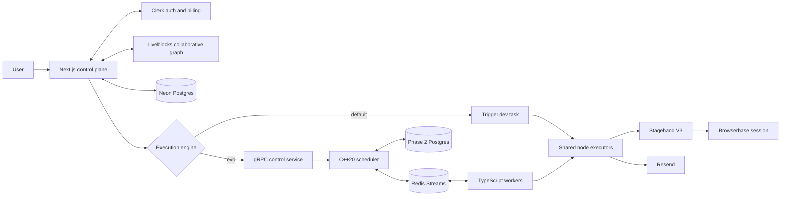

# Evo Builder / EvoBrowser Engine

> AI-planned, real-time collaborative browser automation with an editable visual canvas, durable execution, live browser viewing, results, and session replay.

[](https://nextjs.org/)
[](https://react.dev/)
[](https://docs.stagehand.dev/)
[](https://trigger.dev/)
[](engine/)


Evo Builder turns a plain-language goal into a validated workflow, places it on a multiplayer visual canvas, and runs it in a Browserbase cloud browser through Stagehand. Users can watch the browser, inspect node progress and outputs, stop execution, review the final screenshot, and replay the recorded session.

The repository contains two execution paths:

- **Phase 1 — Trigger.dev, default:** durable sequential execution used by default in the product.
- **Phase 2 — Evo engine, opt-in:** a C++20 concurrent DAG scheduler, Redis Streams transport, Postgres run store, and TypeScript worker runtime selected only with `EXECUTION_ENGINE=evo`.

Phase 2 does not replace Phase 1. The engine flag is server-side and fail-closed: every unset, empty, or unrecognized value uses Trigger.dev.

## Contents

- [Product tour](#product-tour)
- [Phase 1 and Phase 2](#phase-1-and-phase-2)
- [Workflow nodes](#workflow-nodes)
- [Architecture](#architecture)
- [How execution works](#how-execution-works)
- [State and persistence](#state-and-persistence)
- [Repository layout](#repository-layout)
- [Getting started](#getting-started)
- [Run Phase 1](#run-phase-1-default)
- [Run Phase 2](#run-phase-2-evo-engine)
- [Environment reference](#environment-reference)
- [Testing and CI](#testing-and-ci)
- [Security and observability](#security-and-observability)
- [Evidence and limitations](#evidence-and-limitations)
- [Extending the project](#extending-the-project)
- [Troubleshooting](#troubleshooting)
- [Documentation index](#documentation-index)

## Product tour

### Complete user journey

1. Sign in with Clerk and choose an organization.
2. Create a workflow.
3. Describe the automation goal or choose **Build manually**.
4. The server-side planner receives a catalog derived from the real node registry and returns a structured plan.
5. The app validates and lays out the plan, then applies it to the same Liveblocks-backed React Flow graph used for manual editing.
6. Review or edit nodes and connections.
7. Press **Run**. Planning never starts execution automatically.
8. Watch node states and the live Browserbase session beside the canvas.
9. Stop the run if needed. Browser resources close on completion, failure, and cancellation.
10. Review extracted data, outputs, timing, final URL, final screenshot, and the HLS recording.
11. Edit and rerun with a new run identity and Browserbase session.

### Implemented capabilities

| Area               | Behavior                                                                                                                                                       |
| ------------------ | -------------------------------------------------------------------------------------------------------------------------------------------------------------- |
| AI planning        | Server-only OpenAI-compatible call; registry-derived catalog; Zod and semantic validation; transient retries; explicit `canBuild: false` for unsupported goals |
| Visual editing     | React Flow canvas, drag-and-drop nodes, editable fields and edges, deterministic generated layout, pre-run validation                                          |
| Collaboration      | Liveblocks CRDT graph storage, presence, cursors, selections, and organization-scoped rooms                                                                    |
| Browser automation | Stagehand V3 `act`, `extract`, `observe`, and `agent` in Browserbase cloud sessions                                                                            |
| Live viewing       | Authorized Browserbase debug-URL proxy and a bounded connection handshake before browser work starts                                                           |
| Highlights         | In-page overlays for action targets, observed matches, navigation, extraction, and agent activity                                                              |
| Results            | Engine-neutral console, step outputs, counts, duration, final URL, and final screenshot                                                                        |
| Replay             | Server-proxied Browserbase HLS recording rendered with HLS.js; Pro-gated                                                                                       |
| Data passing       | Upstream interpolation with `{{ nodeId.path }}`, nested fields, and array indexes                                                                              |
| SaaS               | Clerk auth, organizations, Billing plan gates, Neon/Drizzle persistence, Resend email, Sentry                                                                  |

### Lifecycle guarantees

- Every run has an independent run ID and fresh Browserbase session.
- A selected historical replay always resolves that run's session.
- Stop targets only the live run and preserves completed history.
- Finished runs do not leave stale running paint on nodes.
- Generated graphs remain ordinary editable collaborative state.
- Browser work waits up to 60 seconds for the live-view connection, then proceeds so unwatched runs do not hang.
- Results open only after the run reaches a terminal state.

## Phase 1 and Phase 2

| Capability       | Phase 1: Trigger.dev                         | Phase 2: Evo engine                                             |
| ---------------- | -------------------------------------------- | --------------------------------------------------------------- |
| Selection        | Default                                      | Exact value `EXECUTION_ENGINE=evo`                              |
| Scheduler        | Trigger.dev durable task                     | C++20 dependency-aware scheduler                                |
| Execution        | Sequential topological order                 | Independent ready branches can run concurrently                 |
| Browser affinity | One session per run                          | Same-run browser nodes serialize on a capacity-1 affinity key   |
| Transport        | Trigger.dev runtime and metadata             | Redis task, result, control, and event streams                  |
| Durable state    | Trigger.dev plus app artifacts               | Postgres runs, nodes, attempts, leases, versions, idempotency   |
| Retries          | Whole-task Trigger.dev retry                 | Node backoff, jitter, lease recovery, dead-letter behavior      |
| Recovery         | Trigger.dev-managed lifecycle                | Worker crash and scheduler restart reconciliation               |
| Cancellation     | Trigger.dev cancellation and cleanup         | App → gRPC → scheduler → queue → worker → browser               |
| Multi-tenancy    | Clerk authorization                          | Clerk plus optional quotas, backpressure, and weighted fairness |
| UI               | Run, Stop, live view, results, replay, rerun | Same normalized UI; parity is regression-tested                 |

Authorization, organization ownership, graph validation, and the Pro-plan check run before either adapter is selected.

## Workflow nodes

The manifest is [`features/workflows/nodes/node-registry.ts`](features/workflows/nodes/node-registry.ts). The planner, palette, inspector, interpolation suggestions, and executor contract derive from it.

| Node       | Kind        | Inputs                  | Outputs                           | Behavior                                                             |
| ---------- | ----------- | ----------------------- | --------------------------------- | -------------------------------------------------------------------- |
| Start      | Trigger     | None                    | None                              | Required entry point; exactly one trigger per valid graph            |
| Open URL   | Action      | `url`                   | `url`, `title`                    | Loads a URL on the shared run page                                   |
| Act        | Action      | `instruction`           | `success`, `message`, `url`       | Runs one natural-language Stagehand action and highlights its target |
| Extract    | Action      | `instruction`           | `extraction`                      | Extracts page information and shows live progress                    |
| Observe    | Action      | `instruction`           | `matches`, selector, description  | Finds and highlights candidate page elements                         |
| Agent      | Action, Pro | `instruction`           | `success`, `message`, `completed` | Runs an autonomous multi-step Stagehand agent                        |
| Send Email | Action      | `to`, `subject`, `body` | `id`                              | Sends HTML email through Resend                                      |

Examples of downstream interpolation:

```text
{{ open_url.title }}
{{ extract_1.extraction }}
{{ observe_1.matches[0].selector }}
```

The interpolation engine supports dot notation and arrays. Objects are JSON-stringified and missing values resolve safely.

## Architecture



### Web control plane

- Next.js 16 and React 19 render auth, dashboard, editor, planner, console, live view, results, and replay.
- Server Actions create/delete workflows, plan, save/start, cancel, and list Evo runs.
- Route handlers authorize Liveblocks, proxy live view and replay, acknowledge viewer connection, stream Evo events, and serve screenshots.
- Clerk provides identity, organizations, membership, and `pro` entitlement.
- Liveblocks owns the actively edited collaborative graph.
- Neon with Drizzle stores workflows and Phase 1 artifacts.

### Phase 1 execution plane

`runWorkflowAction` validates and saves the graph, then the legacy adapter triggers `runWorkflowTask`. The task orders connected nodes topologically and executes them sequentially. It publishes Trigger.dev realtime metadata, opens at most one Browserbase session, reuses its first page, captures a final screenshot, and closes Stagehand in `finally`.

### Phase 2 execution plane

The Evo adapter converts React Flow state to canonical scheduler JSON and submits it over Protobuf/gRPC. C++ validates and schedules the DAG, Redis Streams carries attempts and results, Postgres stores authoritative state, and TypeScript workers reuse the Phase 1 interpolation and node executors.

Core invariants:

- A terminal node result is persisted before successors unlock.
- Duplicate delivery cannot apply terminal completion twice.
- Redis is at-least-once transport; Postgres is the audit authority.
- Heartbeats prove process liveness; leases prove attempt ownership.
- Expired leases can be reassigned as new attempts.
- Browser nodes for one run reuse and serialize on one affinity session.
- Cancellation is durably requested before terminal finalization.
- Monotonic clocks measure engine durations; wall-clock UTC is persisted for audit.

## How execution works

### Plan and edit

1. `planWorkflowAction` resolves the active organization and validates the goal.
2. `planner-service.ts` sends the registry catalog and goal to an OpenAI-compatible `/chat/completions` endpoint.
3. It strips optional Markdown fences, parses JSON, validates Zod shape, and checks IDs, one Start node, registered types, edges, and cycles.
4. `convert-plan.ts` creates normal nodes and edges with deterministic layered positions.
5. The graph is applied only after Liveblocks storage loads. It never auto-runs.

### Start and execute

1. Client and server require exactly one trigger, at least one edge, and no cycle.
2. The server enforces the Agent Pro entitlement.
3. The graph snapshot is stored in `workflows.graph`.
4. An immutable version is best-effort for legacy and required for Evo.
5. The server selects the engine and creates a fresh run identity.
6. Browser workflows open one Stagehand session and publish its ID immediately.
7. The viewer posts a handshake after the live iframe connects; execution waits for it within the bounded timeout.
8. Nodes execute with interpolated upstream values and stream status, output, duration, and errors.
9. The final screenshot is captured before session shutdown.
10. Results and the selected session replay remain tied to the run identity.

## State and persistence

| State             | Owner                   | Notes                                               |
| ----------------- | ----------------------- | --------------------------------------------------- |
| Editable graph    | Liveblocks              | CRDT canvas state scoped to an organization         |
| Run snapshot      | `workflows.graph`       | Saved on Run                                        |
| Phase 1 lifecycle | Trigger.dev             | Metadata and task output feed the UI                |
| Live handshake    | `live_view_connections` | Prevents automation racing the viewer               |
| Screenshot        | `run_artifacts`         | Served through an org-authorized route              |
| Versions          | `workflow_versions`     | Immutable graph, version number, canonical hash     |
| Runs              | `workflow_runs`         | Engine, status, outcome, cancel data, session, DAG  |
| Nodes             | `node_runs`             | Logical status, output, failure, retry wait         |
| Attempts          | `task_attempts`         | Worker, attempt status, error, and lease timestamps |
| Workers           | `workers`               | Registry and heartbeats                             |
| Idempotency       | `idempotency_records`   | Durable operation key and response                  |

Phase 2 migrations are additive. Its local scripts use only `EVO_PHASE2_*` targets and never derive a database from `DATABASE_URL`, protecting Neon from accidental local test operations.

## Repository layout

```text
app/                         Next.js pages and route handlers
components/                  App shell and reusable UI primitives
features/workflows/
  components/                Canvas, planner, live view, console, results, replay
  hooks/                     Entitlement and upstream-connection hooks
  lib/                       Planning, validation, engines, versions, run models
  nodes/                     Node registry and shared executors
  tasks/                     Trigger.dev Phase 1 task
lib/db/                      Drizzle clients, schema, migrations
engine/
  app/                       gRPC service, smoke, benchmark, run driver
  core/                      DAG, scheduler, policy, state, metrics, logging
  pg/                        Postgres run store
  proto/                     Protobuf contract and generated C++
  redis/                     Redis Streams transport
  tests/                     Unit, integration, stress, scaling, chaos
worker/                      Phase 2 TypeScript worker
infra/phase2/                Loopback Redis/Postgres Docker Compose stack
scripts/phase2/              Infra, migration, health, benchmark scripts
docs/                        Phase reports, design, security, evidence
specs/                       Product and UI specifications
design/                      Product screenshots
.github/workflows/ci.yml     Repository quality gates
.env.example                 Environment template
trigger.config.ts            Trigger.dev configuration
```

## Getting started

### Default-stack prerequisites

- Node.js 20+ and npm 10+
- Clerk with Organizations enabled
- Neon Postgres
- Trigger.dev project
- Liveblocks project
- Browserbase project
- Resend for email nodes
- OpenAI-compatible planner provider
- Sentry, optional

Phase 2 additionally needs CMake 3.25+, a C++20 compiler with `std::jthread`, Ninja, Docker, and Protobuf/gRPC, hiredis, and libpq development packages for the full distributed build. See [`docs/phase2/BUILDING_ENGINE.md`](docs/phase2/BUILDING_ENGINE.md).

### Install

```bash
git clone https://github.com/UtkarsHMer05/EvoBrowser.git
cd EvoBrowser
npm ci
cp .env.example .env.local
```

Fill in `.env.local`; never commit it.

### Database

For prototyping:

```bash
npm run db:push
```

For migrations:

```bash
npm run db:generate
npm run db:migrate
```

Drizzle prefers `DATABASE_URL_UNPOOLED` and falls back to `DATABASE_URL`.

### Clerk

1. Enable Organizations.
2. Configure the sign-in/up URLs in `.env.example`.
3. Create a Billing plan with the exact slug `pro`.
4. Confirm users can choose an active organization.

Agent and replay gates are enforced server-side.

## Run Phase 1 (default)

Terminal 1:

```bash
npx trigger.dev dev
```

Terminal 2:

```bash
npm run dev
```

Open [http://localhost:3000](http://localhost:3000), sign in, choose an organization, and create a workflow.

Production commands:

```bash
npm run build
npm start
```

### Deploying runs to production (e.g. Railway + Trigger.dev cloud)

There are TWO runtimes in a production Phase 1 setup, and mixing them up is the
most common "Run does nothing in production" cause:

1. **The Next.js app** (Railway) — renders UI, triggers runs via the SDK.
2. **The run task itself** — executes on **Trigger.dev infrastructure**, NOT on
   Railway. `npx trigger.dev dev` only executes tasks on your laptop; it never
   runs for a deployed app.

Setup checklist:

- **Deploy the task to the production environment** (once, and after every task
  code change), from the repo with the PROD secret key in your shell:

  ```bash
  TRIGGER_SECRET_KEY=tr_prod_… npx trigger.dev@v4 deploy --env prod
  ```

- **Give the TASK its own env vars** in the Trigger.dev dashboard
  (Project → Environments → Prod → Env Vars). Task execution cannot read
  Railway's variables:

  | Variable | Why |
  | ------------------- | ---------------------------------------------- |
  | `DATABASE_URL` | The task loads the workflow graph from Neon |
  | `BROWSERBASE_API_KEY` | Stagehand sessions, screenshots, live view |
  | `RESEND_API_KEY` | Send Email node |
  | `SENTRY_DSN` | Optional task telemetry |

- **Railway app vars** need their own full set: Clerk keys (+ redirect URLs
  pointing at the Railway domain), `DATABASE_URL`, Liveblocks keys,
  `BROWSERBASE_API_KEY` (the live-view/replay/screenshot proxies call it),
  `TOKENROUTER_API_KEY`, and `TRIGGER_SECRET_KEY` — which must be the key of
  the SAME project/environment you deployed the task to.

Verify in the Trigger.dev dashboard → Runs: a triggered run should appear
immediately. Stuck in **Queued** forever ⇒ no worker is deployed to that
environment (step 1). **Failed** within seconds ⇒ open the run's log — usually
a missing task env var (step 2). The console UI also surfaces both cases with
an amber banner ("No worker has picked up this run") instead of hanging
silently.

## Run Phase 2 (Evo engine)

Phase 2 uses isolated local Redis at `127.0.0.1:6390` and Postgres at `127.0.0.1:5433`.

### 1. Build the full engine

```bash
cmake -S engine -B engine/build -G Ninja -DCMAKE_BUILD_TYPE=Release
cmake --build engine/build
```

A core-only build can test the scheduler but cannot run the gRPC/Redis/Postgres product path. Install missing dependencies using the engine build guide.

### 2. Start and migrate infrastructure

```bash
scripts/phase2/up.sh
scripts/phase2/migrate-local.sh
scripts/phase2/health.sh
```

### 3. Add Phase 2 settings to `.env.local`

```dotenv
EXECUTION_ENGINE=evo
EVO_SCHEDULER_ADDR=127.0.0.1:50051
EVO_ENGINE_TOKEN=replace-with-one-shared-local-secret
EVO_PHASE2_REDIS_HOST=127.0.0.1
EVO_PHASE2_REDIS_PORT=6390
EVO_PHASE2_PG_HOST=127.0.0.1
EVO_PHASE2_PG_PORT=5433
EVO_PHASE2_PG_USER=evo
EVO_PHASE2_PG_PASSWORD=evo_dev_password
EVO_PHASE2_PG_DB=evo_phase2
EVO_WORKER_ENV_PREFIX=evo:dev
EVO_WORKER_GROUP=workers
```

The TypeScript worker loads `.env.local`. The C++ binary does not, so pass its token and any non-default C++ settings in the launching shell.

### 4. Start scheduler, worker, and app

Terminal 1:

```bash
EVO_ENGINE_TOKEN=replace-with-one-shared-local-secret \
  ./engine/build/evo-scheduler-server
```

Terminal 2:

```bash
npx tsx worker/src/main.ts
```

Terminal 3:

```bash
npm run dev
```

The scheduler defaults to gRPC `127.0.0.1:50051` and Prometheus metrics `127.0.0.1:9090`. Set `EVO_METRICS_PORT=0` to disable metrics. Run more workers in extra terminals if desired.

Return to Phase 1 by removing `EXECUTION_ENGINE` or setting it to `legacy`.

Stop local infrastructure with `scripts/phase2/down.sh`. `scripts/phase2/reset.sh` destroys and recreates only the isolated Phase 2 containers and volumes.

## Environment reference

### Application services

| Variable                                    | Required for   | Purpose                                          |
| ------------------------------------------- | -------------- | ------------------------------------------------ |
| `NEXT_PUBLIC_CLERK_PUBLISHABLE_KEY`         | App            | Clerk browser key                                |
| `CLERK_SECRET_KEY`                          | App            | Clerk server API and auth                        |
| `NEXT_PUBLIC_CLERK_SIGN_IN_URL`             | App            | Usually `/sign-in`                               |
| `NEXT_PUBLIC_CLERK_SIGN_UP_URL`             | App            | Usually `/sign-up`                               |
| `NEXT_PUBLIC_CLERK_*_FALLBACK_REDIRECT_URL` | App            | Post-auth redirects                              |
| `DATABASE_URL`                              | App            | Pooled Neon runtime connection                   |
| `DATABASE_URL_UNPOOLED`                     | Migrations     | Direct Drizzle connection                        |
| `TRIGGER_SECRET_KEY`                        | Phase 1        | Trigger.dev task control                         |
| `NEXT_PUBLIC_LIVEBLOCKS_PUBLIC_KEY`         | Collaboration  | Browser connection                               |
| `LIVEBLOCKS_SECRET_KEY`                     | Collaboration  | Room and token management                        |
| `BROWSERBASE_API_KEY`                       | Browser nodes  | Stagehand sessions, view, replay                 |
| `RESEND_API_KEY`                            | Email node     | Resend email delivery                            |
| `TOKENROUTER_API_KEY`                       | Planner        | Planner provider bearer key                      |
| `TOKENROUTER_BASE_URL`                      | Optional       | Defaults to `https://api.tokenrouter.com/v1`     |
| `PLANNER_MODEL`                             | Optional       | Defaults to `deepseek/deepseek-v4-pro-0813-free` |
| `NEXT_PUBLIC_SENTRY_DSN`                    | Optional       | Browser Sentry                                   |
| `SENTRY_DSN`                                | Optional       | Server/edge Sentry                               |
| `SENTRY_AUTH_TOKEN`                         | Optional build | Source map upload                                |

The planner must support OpenAI-compatible `/chat/completions` with JSON output. Browser actions use Browserbase Model Gateway with `google/gemini-2.5-flash`; no separate browser-model key is required.

### Evo runtime

| Variable                             | Default            | Purpose                                      |
| ------------------------------------ | ------------------ | -------------------------------------------- |
| `EXECUTION_ENGINE`                   | `legacy`           | Only `evo` selects Phase 2                   |
| `EVO_SCHEDULER_ADDR`                 | `127.0.0.1:50051`  | gRPC address                                 |
| `EVO_ENGINE_TOKEN`                   | Empty              | Shared gRPC token; empty disables token auth |
| `EVO_METRICS_PORT`                   | `9090`             | Loopback metrics port; `0` disables          |
| `EVO_PHASE2_REDIS_HOST`              | `127.0.0.1`        | Redis host                                   |
| `EVO_PHASE2_REDIS_PORT`              | `6390`             | Redis port                                   |
| `EVO_PHASE2_REDIS_PASSWORD`          | Empty              | Optional password                            |
| `EVO_PHASE2_REDIS`                   | `127.0.0.1:6390`   | Integration-test endpoint                    |
| `EVO_PHASE2_PG_HOST`                 | `127.0.0.1`        | Postgres host                                |
| `EVO_PHASE2_PG_PORT`                 | `5433`             | Postgres port                                |
| `EVO_PHASE2_PG_USER`                 | `evo`              | Postgres user                                |
| `EVO_PHASE2_PG_PASSWORD`             | `evo_dev_password` | Local-only password                          |
| `EVO_PHASE2_PG_DB`                   | `evo_phase2`       | Database name                                |
| `EVO_WORKER_ENV_PREFIX`              | `evo:dev`          | Redis namespace                              |
| `EVO_WORKER_GROUP`                   | `workers`          | Consumer group                               |
| `EVO_WORKER_ID`                      | Generated          | Stable worker identity override              |
| `EVO_WORKER_LEASE_DURATION_MS`       | Internal default   | Lease duration override                      |
| `EVO_WORKER_LEASE_RENEW_INTERVAL_MS` | Internal default   | Lease renewal override                       |
| `EVO_WORKER_HEARTBEAT_INTERVAL_MS`   | Internal default   | Heartbeat override                           |

### Quotas and fairness

Quota values default to `0`, meaning disabled.

| Variable                               | Purpose                                 |
| -------------------------------------- | --------------------------------------- |
| `EVO_QUOTA_MAX_ACTIVE_RUNS_PER_ORG`    | Per-org active-run cap                  |
| `EVO_QUOTA_MAX_ACTIVE_RUNS_GLOBAL`     | Global active-run cap                   |
| `EVO_QUOTA_MAX_INFLIGHT_TASKS_PER_ORG` | Per-org task cap                        |
| `EVO_QUOTA_BROWSER_CAPACITY`           | Global browser capacity                 |
| `EVO_QUOTA_EXTERNAL_IO_CAPACITY`       | Global external-I/O capacity            |
| `EVO_FAIR_SCHEDULING`                  | `1` enables weighted least-served-first |
| `EVO_ORG_WEIGHTS`                      | Weights such as `org-a:2,org-b:1`       |
| `EVO_FAIR_DEMAND_TIMEOUT_MS`           | Demand freshness window                 |

Harness-only `EVO_DRIVER_*`, `EVO_M*_REPO_ROOT`, `EVO_LOCAL_SLEEP_MS`, `EVO_SCHEDULER_SERVER_BIN`, and `EVO_GRPC_CPP_PLUGIN` variables are documented beside their tests/scripts.

## Testing and CI

Run Node gates sequentially:

```bash
npm test
npm run typecheck
npm run lint
npm run build
```

`npm test` runs the suites under Vitest (`npm run test:watch`, `npm run test:coverage` for watch mode and V8 coverage). Coverage spans planning, conversion, editability, lifecycle, interpolation, Protobuf, workflow versions, cross-language envelopes, the server-action boundary (shape validation, Pro gate, engine routing), run authorization, every per-run artifact proxy route, worker execution, browser session ownership, logging, engine adapters, gRPC, normalized views, and 9/9 legacy/Evo console parity scenarios. Distributed sections print `SKIP` when local Redis/Postgres is unavailable; start and migrate Phase 2 to exercise them — CI runs them inside its `distributed` job, where both services exist. Each suite can still be run standalone with `tsx <file>` outside the runner (mock-based unit suites are Vitest-only). Coverage thresholds ratchet: a modest global floor plus strict per-file floors on the security-critical authorization and route-handler code.

Do not run `typecheck` concurrently with `build`: both use `.next/types`, and Next.js replaces generated route types during compilation.

### C++ suite

```bash
cmake -S engine -B engine/build -G Ninja -DCMAKE_BUILD_TYPE=Release
cmake --build engine/build
ctest --test-dir engine/build --output-on-failure
```

The full configured build registers 31 tests covering DAG/state, schedulers, affinity, queues, thread pool, stress, quotas/fairness, metrics/logging/auth/limits, transport, envelopes, retry, gRPC, Redis, Postgres, distributed execution, crash/restart recovery, scaling, and chaos.

Sanitizer suites use separate builds:

```bash
cmake -S engine -B engine/build-asan -G Ninja -DEVO_ENABLE_ASAN=ON
cmake --build engine/build-asan
ctest --test-dir engine/build-asan --output-on-failure

cmake -S engine -B engine/build-tsan -G Ninja -DEVO_ENABLE_TSAN=ON
cmake --build engine/build-tsan
ctest --test-dir engine/build-tsan --output-on-failure
```

Additional gates:

```bash
scripts/secret-scan.sh
scripts/phase2/bench-smoke.sh engine/build/evo-bench
```

GitHub Actions runs secret scanning; Node tests/typecheck/lint/build with a coverage report artifact and ratcheting thresholds; GCC and Clang; ASan/UBSan; TSan; real Redis/Postgres/gRPC integration (including the Vitest distributed sections, which only execute where the services exist); and benchmark-structure smoke without paid external keys or timing assertions.

### Manual integration smoke test

1. Sign in and choose an organization.
2. Generate a workflow and confirm it does not auto-run.
3. Edit and run it.
4. Confirm live view connects before the first action.
5. Inspect status and highlights.
6. Confirm terminal outputs, URL, timing, and screenshot.
7. Replay the selected historical run.
8. Edit and rerun; verify new run/session IDs.
9. Stop an active run and verify cleanup.
10. Verify cross-org workflow, live-view, screenshot, and replay access is rejected.

## Security and observability

- Secrets remain server/worker-only unless explicitly `NEXT_PUBLIC_`.
- Workflow access is filtered by the active Clerk organization.
- Liveblocks tokens and rooms are organization-scoped.
- Live view checks authentication, run/workflow ownership, and matching session ID.
- Screenshots check organization ownership.
- Replay checks authentication, Pro entitlement, and that the run owning the session belongs to the caller's organization — the same shared ownership rule every per-run artifact route enforces via `authorizeRunAccess`.
- Agent entitlement is checked before engine selection.
- Evo uses constant-time engine-token comparison when configured.
- Phase 2 validates identifiers and input sizes and redacts secrets, bearer tokens, and URL credentials from structured logs.
- Local Redis, Postgres, gRPC, and metrics bind to loopback; those are not production network-security defaults.
- CI scans tracked files for secrets and needs no paid key.

Sentry instruments browser, server, edge, actions, and errors. Trigger.dev supplies Phase 1 task telemetry. Evo publishes run events and reconstructs UI state from durable snapshots. C++ and worker logs carry correlation fields, and Evo exports Prometheus metrics on loopback port `9090` by default. Browserbase supplies live view and recording; replay is proxied because retrieval requires the secret API key.

See [`docs/phase2/SECURITY.md`](docs/phase2/SECURITY.md) for the full threat model.

## Evidence and limitations

Phase 2 evidence was captured on an Apple M2 Release build. See [`RESUME_EVIDENCE.md`](docs/phase2/RESUME_EVIDENCE.md) and [`BENCHMARK_METHODOLOGY.md`](docs/phase2/BENCHMARK_METHODOLOGY.md).

| Finding                          | Result                                                                 |
| -------------------------------- | ---------------------------------------------------------------------- |
| Simulated I/O local scheduler    | 2.01× at 2 threads, 4.01× at 4, 8.01× at 8 vs sequential               |
| Synthetic CPU thread scaling     | 2.01× at 2, 3.75× at 4, 5.57× at 8 vs concurrent one-thread            |
| Distributed pipeline throughput  | Batched result consumption raised sustained 500-task throughput 107.8 → 182.3 tasks/s median at 1 worker (+69%) |
| Distributed worker scaling       | Pre-M41: 2 workers ≈ 1.08–1.14×, 4 workers 0.81–0.87×; after batching the regression is gone (4 workers ≈ 0.998× of 1 worker) — flat by design for this workload shape, since one async worker already overlaps the synthetic sleeps |
| Distributed audit range          | Zero lost or duplicated tasks across 100 / 500 / 1,000-task DAGs at 1/2/4 workers (durable-store audit per trial) |
| Redis/Postgres outage injection  | Both recovered to 30/30 task completion                                |
| Worker SIGKILL recovery          | Median 6.468 s across 7 trials (min 6.347 / max 6.508)                 |
| Weighted fair scheduling         | Under explicit 2:1 entitlements: contended-window service ratio 1.75 vs 1.00 unweighted control, Jain(normalized) 0.996, final grants exactly 2:1, no starvation |

Limits and honest non-claims:

- Synthetic scheduler results are not browser end-to-end speedups; no paid Browserbase campaign ran.
- Distributed workers do not scale linearly for fine-grained work: after M41 batched result consumption the 4-worker regression is gone (≈1.00× relative), but throughput stays ~flat across worker counts because a single asynchronous worker already overlaps the synthetic sleeps — the benchmark measures pipeline throughput, not compute scaling.
- Delivery is at least once with dedupe and at-most-once logical terminal application, not exactly-once external side effects.
- Recovery has a detection window; there is no zero-downtime claim.
- Phase 1 is sequential, uses one page/session, and retries the whole task; Stop is honored cooperatively at node boundaries (not-yet-run steps are published as canceled) and there is no Resend idempotency key.
- Planner structure is validated, but instruction quality depends on the model.
- Live view is bounded and best-effort; recording is the durable visual record.
- gRPC is loopback insecure transport; the token is shared, not per org. Local Redis auth is disabled.

## Extending the project

### Add a node

Make exactly three implementation edits under `features/workflows/nodes/`:

1. Implement `<node-name>.ts`.
2. Register it in `node-executors.ts`; the `satisfies` contract catches missing action executors.
3. Add its type, kind, label, icon, accent, fields, and outputs to `node-registry.ts`.

Do not edit the canvas step component or run task: they are registry-driven. Add planner/conversion, execution, and worker-parity tests. Side-effecting Evo nodes should consume the deterministic `NodeContext.idempotencyKey`.

### Database and runtime changes

Define tables in `lib/db/schema.ts` and derive types with Drizzle `$inferSelect`/`$inferInsert`. Review generated migrations. Shared/remote Phase 2 migrations require human approval; local scripts intentionally cannot target `DATABASE_URL`.

The Phase 1 task is `features/workflows/tasks/run-workflow.ts`; `trigger.config.ts` scans `trigger/` and `features/workflows/tasks/`. Preserve explicit Run semantics and cleanup on every terminal path.

The canvas uses `@xyflow/react` 12.11.2 and Liveblocks bindings. Consult current React Flow documentation before API changes.

### Commands

| Command                           | Purpose                                   |
| --------------------------------- | ----------------------------------------- |
| `npm run dev`                     | Next.js webpack development server        |
| `npm run build` / `npm start`     | Build and serve production                |
| `npm test`                        | Node/TypeScript regression suites (Vitest) |
| `npm run test:watch`              | Vitest watch mode                          |
| `npm run test:coverage`           | V8 coverage report for the Node suites     |
| `npm run typecheck`               | TypeScript without emit                   |
| `npm run lint`                    | ESLint                                    |
| `npm run format`                  | Rewrite TS/TSX with Prettier              |
| `npm run db:generate`             | Generate Drizzle migration                |
| `npm run db:migrate`              | Apply app migrations                      |
| `npm run db:push`                 | Push schema directly                      |
| `npm run db:studio`               | Drizzle Studio                            |
| `scripts/phase2/up.sh`            | Start Phase 2 Redis/Postgres              |
| `scripts/phase2/health.sh`        | Check local infrastructure                |
| `scripts/phase2/migrate-local.sh` | Migrate local Phase 2 Postgres            |
| `scripts/phase2/down.sh`          | Stop local infrastructure                 |
| `scripts/phase2/reset.sh`         | Destructively recreate local Phase 2 data |
| `scripts/phase2/schema-smoke.sh`  | Validate local schema                     |
| `scripts/phase2/bench-smoke.sh`   | Check benchmark artifact structure        |
| `scripts/phase2/m39-campaign.sh`  | Run scaling/chaos campaign                |
| `scripts/secret-scan.sh`          | Scan tracked files for secrets            |

## Troubleshooting

### Planner key missing

Set `TOKENROUTER_API_KEY` in `.env.local` and restart Next.js. For another provider set `TOKENROUTER_BASE_URL` and `PLANNER_MODEL`.

### Workflow does not start

Require one Start, at least one edge, and no cycle. For Phase 1 check `TRIGGER_SECRET_KEY` and `npx trigger.dev dev`. For Phase 2 check the flag, migrations, scheduler health, and matching `EVO_ENGINE_TOKEN`.

### Distributed tests skip

```bash
scripts/phase2/up.sh
scripts/phase2/migrate-local.sh
npm test
```

### Typecheck reports missing `.next/types`

Run typecheck and build sequentially. Next.js replaces generated route types during build.

### Live view keeps connecting

Check the Browserbase key/session, run ownership, and `/api/live-view/[sessionId]`. Execution proceeds after 60 seconds to avoid hanging.

### Replay unavailable

Confirm a browser session existed, Browserbase finished recording, the user has `pro`, and the replay proxy can retrieve the HLS manifest.

### CMake builds core only

Install Protobuf/gRPC, hiredis, and libpq development packages, regenerate Protobuf if required, and reconfigure. Follow the engine build guide.

## Documentation index

| Document                                                                                       | Purpose                                                   |
| ---------------------------------------------------------------------------------------------- | --------------------------------------------------------- |
| [`docs/PHASE-1-IMPLEMENTATION-REPORT.md`](docs/PHASE-1-IMPLEMENTATION-REPORT.md)               | Phase 1 architecture, setup, tests, security, limitations |
| [`docs/phase2/PHASE-2-IMPLEMENTATION-REPORT.md`](docs/phase2/PHASE-2-IMPLEMENTATION-REPORT.md) | Final Phase 2 summary                                     |
| [`docs/phase2/ARCHITECTURE.md`](docs/phase2/ARCHITECTURE.md)                                   | Engine topology, state, affinity                          |
| [`docs/phase2/BUILDING_ENGINE.md`](docs/phase2/BUILDING_ENGINE.md)                             | Toolchain, builds, sanitizers                             |
| [`docs/phase2/LOCAL_INFRA.md`](docs/phase2/LOCAL_INFRA.md)                                     | Redis/Postgres operation and safety                       |
| [`docs/phase2/FAILURE_MODEL.md`](docs/phase2/FAILURE_MODEL.md)                                 | Failure, retry, lease, recovery semantics                 |
| [`docs/phase2/SECURITY.md`](docs/phase2/SECURITY.md)                                           | Threat model and controls                                 |
| [`docs/phase2/BENCHMARK_METHODOLOGY.md`](docs/phase2/BENCHMARK_METHODOLOGY.md)                 | Evidence rules                                            |
| [`docs/phase2/RESUME_EVIDENCE.md`](docs/phase2/RESUME_EVIDENCE.md)                             | Claim registry                                            |
| [`docs/phase2/RELEASE_CHECKLIST.md`](docs/phase2/RELEASE_CHECKLIST.md)                         | Release gates                                             |
| [`docs/phase2/PROGRESS.md`](docs/phase2/PROGRESS.md)                                           | M01–M40 history                                           |
| [`docs/phase2/DECISIONS.md`](docs/phase2/DECISIONS.md)                                         | Architecture decisions                                    |
| [`docs/phase2/PHASE1_BASELINE.md`](docs/phase2/PHASE1_BASELINE.md)                             | Preserved behavior                                        |
| [`docs/phase2/SYSTEM_DESIGN_NOTES.md`](docs/phase2/SYSTEM_DESIGN_NOTES.md)                     | Detailed design notes                                     |
| [`docs/phase2/LOCAL_SCHEDULER_BENCHMARK.md`](docs/phase2/LOCAL_SCHEDULER_BENCHMARK.md)         | Scheduler benchmark report                                |

See [`specs/`](specs/) for UI/product chapters and [`design/`](design/) for screenshots.

## Status

- Phase 1 is implemented and remains the default.
- Phase 2 milestones M01–M40 are implemented behind the Evo flag.
- Automated coverage includes Node, C++, sanitizers, distributed integration, secret scanning, scaling, and chaos.
- Production-hardening opportunities include TLS and stronger service identity, authenticated production Redis, provider-wide idempotency, paginated durable history, and paid browser end-to-end measurement. (Batched result consumption — formerly on this list — shipped as M41.)
